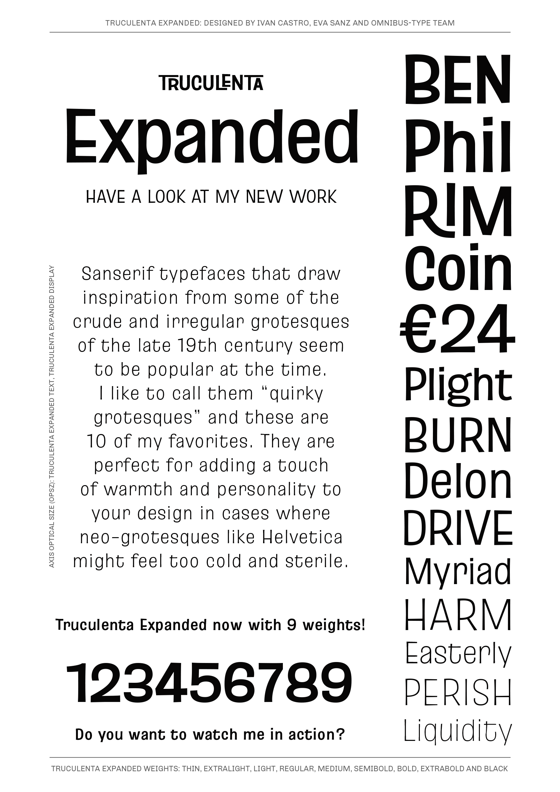
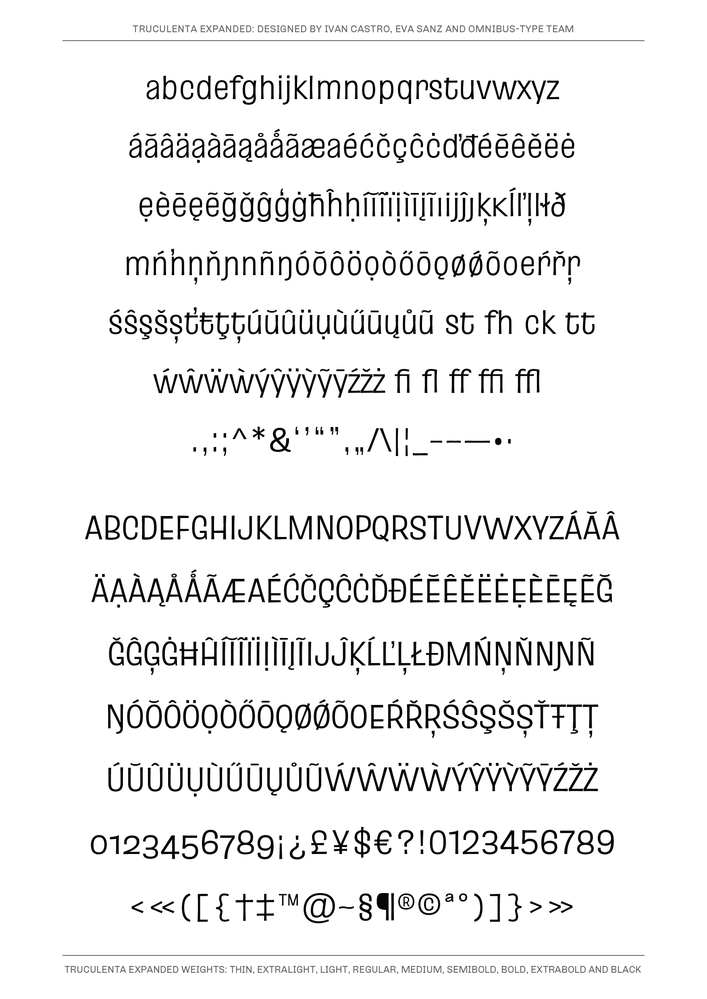
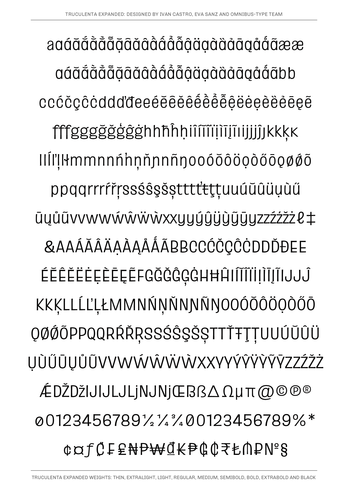

# Truculenta Expanded family

**Ivan Castro, Eva Sanz & Omnibus-Type Team**
*SIL Open Font License 1.1,*
*18 fonts (9 display, 9 text), +800 glyphs each variant.*

Truculenta Expanded is an irregular sans serif typeface based on mid-century lettering works, yet with a little twist. This new quirky grotesque is a superfamily with variable font format in 3 axes: Width (wdth), Weight (wght) and Optical Size (opsz). Each variant has 1420 glyphs, with 2 sets of tabular figures (lining and old-style) and a set of 135 ligatures with support for 39 languages. This typeface is highly suitable for packaging, branding, book covers, illustrated editions, and film titles, since its personality may be more vibrant than the usual cold neo-grotesque. The text version has been specially designed to compose paragraphs in text sizes. Designed by Ivan Castro, Eva Sanz & Omnibus-Type Team

Language support: Afrikaans, Albanian, Azerbaijani, Basque, Bosnian, Catalan, Croatian, Czech, Danish, Dutch, English, Estonian, Faroese, Filipino, Finnish, French, Galician, German, Hungarian, Icelandic, Indonesian, Irish, Italian, Latvian, Lithuanian, Malay, Norwegian Bokmål, Polish, Portuguese, Romanian, Slovak, Slovenian, Spanish, Swahili, Swedish, Turkish, Vietnamese, Welsh, Zulu.

#### Truculenta Expanded Family contains:
* On display set
* Thin
* ExtraLight
* Light
* Regular
* Medium
* SemiBold
* Bold
* ExtraBold
* Black

* On text set
* Thin Text
* ExtraLight Text
* Light Text
* Regular Text
* Medium Text
* SemiBold Text
* Bold Text
* ExtraBold Text
* Black Text

To contribute to the project contact [Omnibus-Type](http://omnibus-type.com/).

### Designers

* Ivan Castro & Eva Sanz

### License

Copyright (c) 2020, Omnibus-Type (www.omnibus-type.com | omnibus.type@gmail.com)

Licensed under the [*SIL Open Font License, 1.1*](http://scripts.sil.org/OFL); you may not use this file except in compliance with the License.

======
## FONTLOG for the Truculenta Expanded fonts

This file provides detailed information on the Truculenta Expanded font software.  
This information should be distributed along with the Truculenta Expanded fonts and any derivative works.

### Truculenta Expanded is a typeface family that supports the following Unicode language range: 

* Basic Latin 					U+0020-U+007E
* Latin-1 Supplement 				U+00A0-U+00FF
* Latin Extended-A 				U+0100-U+017F
* Latin Extended Additional*			U+1E00-U+1EFF *(111/256)

**Character map to support MS Codepages:**
* 1252 Latin-1
* 1250 Latin-2 (Easter Europe)
* 1254 Turkish
* 1257 Windows Baltic
* 1258 Vietnamese
* Mac Roman

*To contribute to the project contact Omnibus-Type at omnibus.type@gmail.com*

**2020 March 30 (v1.000) Initial Commit (Omnibus-Type)**
- Initial commit

### Acknowledgements

If you make modifications be sure to add your name (N), email (E), web-address
(if you have one) (W) and description (D). This list is in alphabetical order.

**N:** **Yorlmar Campos**  
**E:** omnibus.type@gmail.com  
**W:** http://www.omnibus-type.com  
**D:** Typeface development

**N:** **Ivan Castro**  
**E:** hola@ivancastro.es  
**W:** http://www.ivancastro.es 
**D:** Designer 

**N:** **Eva Sanz**  
**E:** eva@ladyeve.es.
**W:** http://ladyeve.es  
**D:** Designer 
